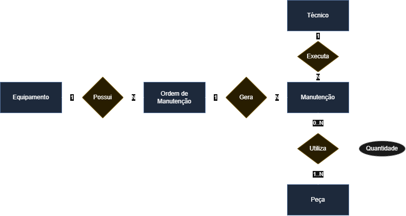
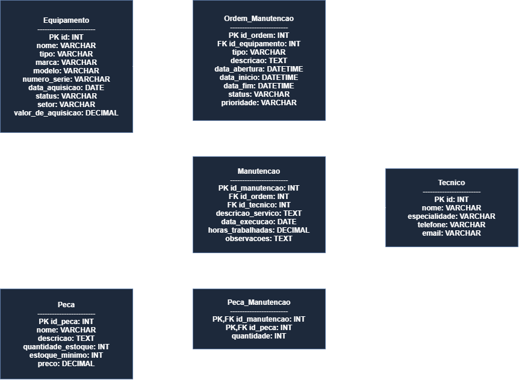

# sesi_bcd_vps01_manutencao_de_equipamento_2026

 
## Um banco de dados de manutenção de equipamentos em uma fábrica, onde o objetivo é controlar os equipamentos, seu histórico de manutenção, os técnicos responsáveis, peças utilizadas e as ordens de serviço.

## MER DER

## Markdown

| Atributo | Tipo de Dado | Restrições | Descrição |
|---|---|---|---|
| `id` | INT | **PK**, Auto Increment | Identificador único do equipamento |
| `nome`| VARCHAR(100) | NOT NULL | Nome descritivo (Ex: Prensa Hidráulica) |
| `tipo`| VARCHAR(50) | - | Categoria (Ex: Mecânico, Elétrico) |
| `marca`| VARCHAR(50) | - | Fabricante do equipamento |
| `modelo` | VARCHAR(50) | - | Modelo técnico de fábrica |
| `numero_serie` | VARCHAR(50) | UNIQUE | Número de série impresso na carcaça |
| `data_aquisicao` | DATE | - | Data de compra |
| `status` | VARCHAR(20) | DEFAULT 'Operacional' | Condição física atual do ativo |
| `setor` | VARCHAR(50) | - | Linha de produção ou área instalada |
| `valor_aquisicao` | DECIMAL(12,2) | - | Custo total de compra do bem |

| Atributo | Tipo de Dado | Restrições | Descrição |
|---|---|---|---|
| `id_ordem` | INT | **PK**, Auto Increment | Identificador único da O.M. |
| `id_equipamento` | INT | **FK**, NOT NULL | Referência ao Equipamento (Equipamento.id) |
| `tipo` | VARCHAR(30) | NOT NULL | Modelo do chamado (Preventiva/Corretiva) |
| `descricao` | TEXT | NOT NULL | Problema relatado ou plano de ação |
| `data_abertura` | DATETIME | NOT NULL, DEFAULT | Registro da abertura do chamado |
| `data_inicio` | DATETIME | - | Início real da execução técnica |
| `data_fim` | DATETIME | - | Fechamento definitivo da ordem |
| `status` | VARCHAR(20) | DEFAULT 'Aberta' | Status da etapa (Aberta/Em Execução/Concluída) |
|  `prioridade` | VARCHAR(15) | - | Grau de urgência (Baixa/Média/Alta/Crítica) |

| Atributo | Tipo de Dado | Restrições | Descrição |
|---|---|---|---|
| `id` | INT | **PK**, Auto Increment | Registro do funcionário técnico |
| `nome` | VARCHAR(100) | NOT NULL | Nome completo do profissional |
| `especialidade` | VARCHAR(50) | - | Área de atuação principal (Ex: Elétrica) |
| `telefone` | VARCHAR(20) | - | Telefone de contato corporativo |
| `email` | VARCHAR(100) | UNIQUE | Endereço eletrônico de contato |

| Atributo | Tipo de Dado | Restrições | Descrição |
|---|---|---|---|
| `id_peca` | INT | **PK**, Auto Increment | Identificador de almoxarifado |
| `nome` | VARCHAR(100) | NOT NULL | Nome do item técnico de reposição |
| `descricao` | TEXT | - | Detalhamento ou part number |
| `quantidade_estoque` | INT | DEFAULT 0 | Volume físico disponível em estoque |
| `estoque_minimo` | INT | DEFAULT 0 | Ponto de pedido mínimo de segurança |
| `preco` | DECIMAL(10,2) | NOT NULL | Valor unitário de mercado da peça |

| Atributo | Tipo de Dado | Restrições | Descrição |
|---|---|---|---|
| `id_manutencao` | INT | **PK**, Auto Increment | Identificador da intervenção física |
| `id_ordem` | INT | **FK**, NOT NULL | Ordem vinculada (Ordem_Manutencao.id_ordem) |
| `id_tecnico` | INT | **FK**, NOT NULL | Técnico que realizou o trabalho (Tecnico.id) |
| `descricao_servico` | TEXT | NOT NULL | Notas detalhadas da atividade executada |
| `data_execucao` | DATETIME | NOT NULL | Dia e hora exatos em que ocorreu a ação |
| `horas_trabalhadas` | DECIMAL(5,2) | NOT NULL | Tempo computado (Homem-Hora) do técnico |
| `observacoes` | TEXT | - | Comentários extras adicionais |

| Atributo | Tipo de Dado | Restrições | Descrição |
|---|---|---|---|
| `id_manutencao` | INT | **PK**, **FK** | Código da manutenção executada (Manutencao.id_manutencao) |
| `id_peca` | INT | **PK**, **FK** | Código da peça retirada do estoque (Peca.id_peca) |
| `quantidade` | INT | NOT NULL, CHECK > 0 | Volume de peças gastas nesta ação |

## Dados de Teste
[Tecnico](<Pasta1.CSV>)
[Equipamento](<Pasta2.CSV>)
[Peca](<Pasta3.CSV>)
[Tecnico](<Pasta4.CSV>)
[Tecnico](<Pasta5.CSV>)
[Tecnico](<Pasta6.CSV>)
